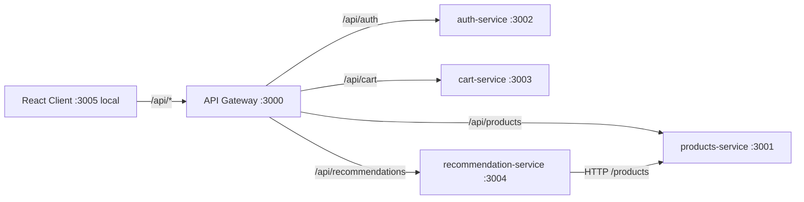

# Arquitetura de Microservicos E-CRF

```mermaid
flowchart LR
  client[React Client :3005 local]
  gateway[API Gateway :3000]
  products[products-service :3001]
  auth[auth-service :3002]
  cart[cart-service :3003]
  rec[recommendation-service :3004]

  client -->|/api/*| gateway
  gateway -->|/api/products| products
  gateway -->|/api/auth| auth
  gateway -->|/api/cart| cart
  gateway -->|/api/recommendations| rec
  rec -->|HTTP /products| products
```

## Status consolidado

O endpoint GET /api/status no gateway consulta o /health de todos os servicos e retorna status, porta e uptime.
